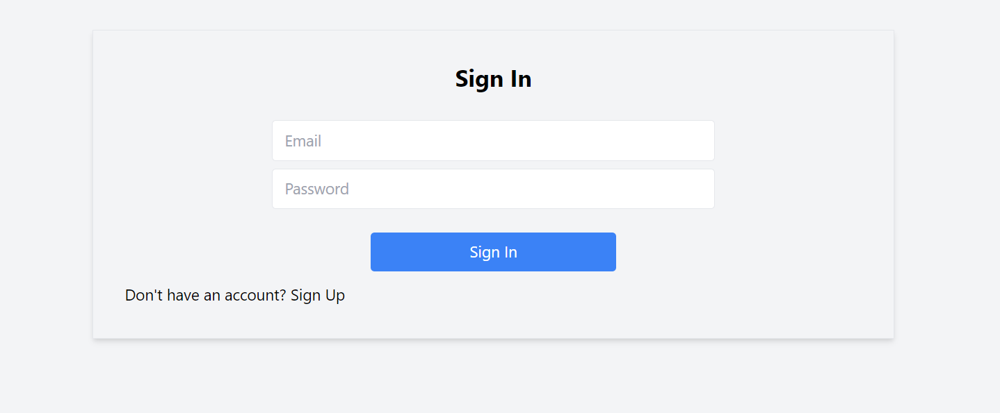
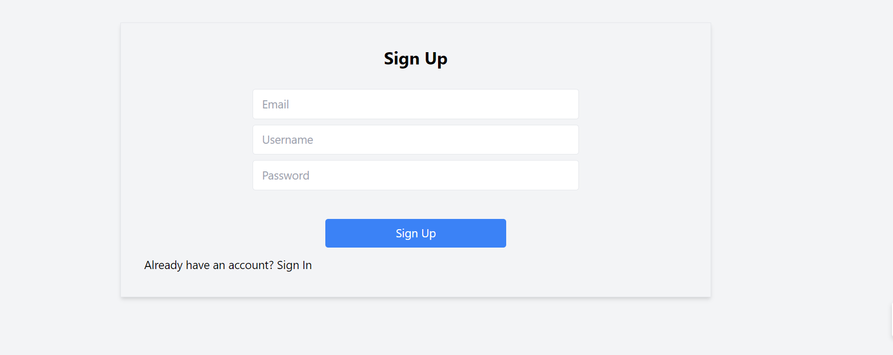
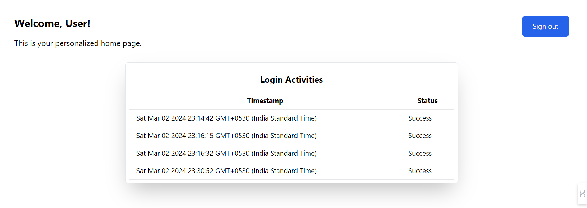
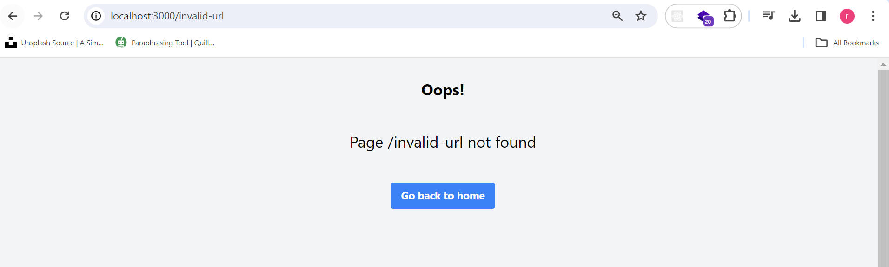

Certainly! Here's a revised version of the text formatted as a `README.md` file for your GitHub project. I've added some additional sections to provide more context and information:

---

# Assignment Project

This project is a small assignment implemented using EJS, Express.js, Node.js, and MySQL. It allows users to create new accounts and sign in using email and password credentials.

## Getting Started

To run this project locally, follow these steps:

1. **Download and Unzip**:
   - Download the project as a zip folder.
   - Unzip the folder in your local machine.

2. **Import Database Scripts**:
   - Open phpMyAdmin or MySQL Workbench.
   - Create a new database (e.g., `assignment_db`).
   - Import the database scripts provided with your project.

3. **Open in VSCode and Install Dependencies**:
   - Open the unzipped project folder in Visual Studio Code (VSCode).
   - Open a terminal in VSCode and run `npm install` to install dependencies.

4. **Run the Project**:
   - Start the project by running `nodemon index.js` in the terminal.

5. **Access the Application**:
   - Open a web browser and navigate to `http://localhost:3000`.
   - Use the provided credentials (`user@gmail.com`, `user`) to sign in.

## Screenshots

Here are some screenshots of the application:

## Additional Notes

- The project uses Express.js as the web framework and MySQL as the database.
- User authentication is implemented using bcrypt for password hashing and JWT for token-based authentication.
- The project includes error handling middleware and middleware for handling undefined routes.
- The project has feature to record unsucessfull/sucessfull attempts to signin into account.
- Feel free to explore the code and make modifications as needed for your own projects.

---

You can add more sections or modify the content based on the specific features and requirements of your project.